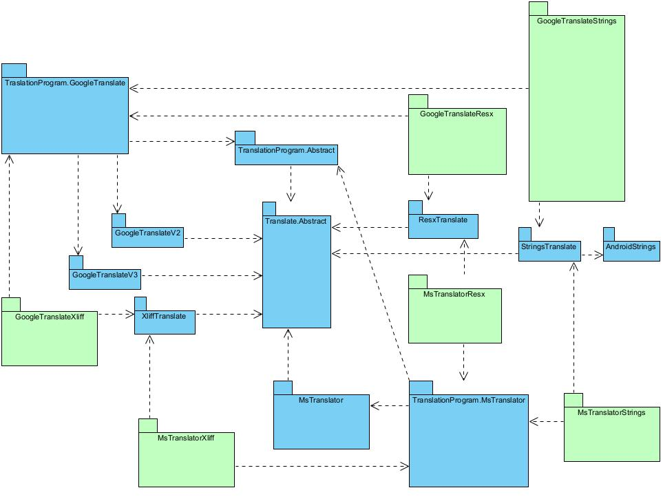
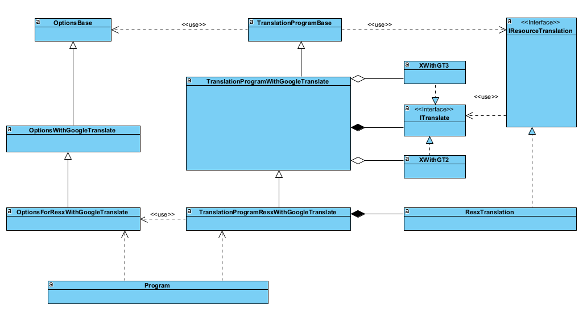

# Roadmap

The scope is within the needs of full-stack software developers. That is, the developer coordinates translation efforts by fellow developers, staffs and external translators.

* Converter between ResX and XLIFF and reconciliation. [Exchanging localizable resources](https://learn.microsoft.com/en-us/globalization/localization/exchanging-localizable-resources) (Done)
* Converter between Android Resource and XLIFF and reconciliation
* Support MS translator. (Done)
* Support [Translation Memory eXchange (TMX)](https://learn.microsoft.com/en-us/globalization/localization/translation-memories)

# Design and Implementation

## Prerequisites

* .NET 9 SDK
* Visual Studio 2022

## Design Choices

During the initial development, XML serialization is used for reading and writing XML files of XLIFF. However, it turned out that the schemas of XLIFF 1.2 and 2.0 are not friendly to XML serialization. That is, though the generated .NET codes could read and write XLIFF files, the orders of plain text and interpolations can not be preserved, thus the semantic structure of translation content is corrupted. Therefore, the implementation is using XElement of XML DOM.

Additionally, through XElement / XML DOM the original layout of the source document can be preserved.

**Remarks:**
* Though there are good .NET libraries like [XLIFF2-Object-Model](https://github.com/microsoft/XLIFF2-Object-Model), it is sufficient enough to use XElement directly since the scop of this project is focused on translating from source to target only, rather than full bloat XML editing and processing.

Please create issue before forking and PR.

## Design

### Packages

### Typical Classes in App

Hints:
* PackDummy.csproj is a dummy project for building of the CLI apps of translation into one release, since these apps share components. There are 3 build scripts for Windows, Mac Self Contained and Linux Self Contained.

## Other Good Tools Used by .NET Developers

These tools provide interactive ways of managing translation:
* Visual Studio's Resource Explorer
* [ResX Resource Manager](https://marketplace.visualstudio.com/items?itemName=TomEnglert.ResXManager) provides some [complementary features](https://github.com/dotnet/ResXResourceManager/tree/master/Documentation), including [synchronisation between ResX and Xliff resource files](https://github.com/dotnet/ResXResourceManager/blob/master/Documentation/Topics/Xliff.md) .
* [PO Editor](https://poeditor.com/)

The tools in this open source project provide the least user interaction through CLI and scripting, and such approach may be more beneficial in some scenarios for the sake of Continuous Integration. And software developers should be able to use these CLI tools along with those interactive tools above.

The scope of this project is not to replace any of the interactive tools, but to offer complementary solutions to software developers to minimize the overall overhead of managing translations.