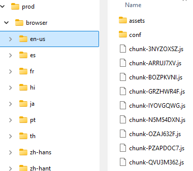
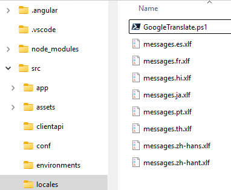

# Batch Processing of Translation Resource for Angular Apps

## Introduction

You have been developing SPA using Angular 2+, and familiar with [i18n with Angular](https://angular.dev/guide/i18n).

Typically, the production build outputs such multiple deployment images for each locale:



And the build retrieves the translated XLIFF files:



Different software shops may have different collaboration workflows of handling localization/translation. If you are a full-stack developer working in a small shop, likely you will the one who proceeds the machine translation, before involving human translators.

There are wide variety of tools available to automate the machine translation as much as possible, most of them are with interactive GUI. If you prefer CLI and batch processing for the sake of Continuous Integration, you may be interested in using [GoogleTranslateXliff](https://github.com/zijianhuang/apptranslation) introduced in this article.

## Continuous Integration with Machine Translation

### Write Codes and Test with Development Build

Most of the time during coding, you would be using the development build in a default language.

### Update Translation Resource Files

Once you (your team) feel confident of making a release, you update, add or merge the translation resource files through this command:

`ng extract-i18n`

By default, all the new translation units are with state "new" (XLIFF 1.2) or "initial" (XLIFF 2.0).

As of Angular 19, it is better to update this command with [ng-extract-i18n-merge](https://github.com/daniel-sc/ng-extract-i18n-merge) which can merge the updates well.

The `.angular.json` file should have the following:
```json
        "extract-i18n": {
            "builder": "ng-extract-i18n-merge:ng-extract-i18n-merge",
            "options": {
    "buildTarget": "myng:build",
    "format": "xlf",
    "outputPath": "src/locales",
    "targetFiles": [
        "messages.zh-hans.xlf",
        "messages.zh-hant.xlf",
        "messages.ja.xlf",
        "messages.th.xlf",
        "messages.es.xlf",
        "messages.pt.xlf",
        "messages.fr.xlf",
        "messages.hi.xlf"
    ],
```

References:
* https://stackoverflow.com/questions/71775495/update-merge-i18n-translation-files-in-angular
* `ng add ng-extract-i18n-merge` from https://github.com/daniel-sc/ng-extract-i18n-merge .


### Translate Using Google Translate API v2 or v3

Prerequisites:
* You have Google Cloud API account, and have acquired API Key for Google Translate v2 or client secret for v3.
* You have [GoogleTranslateStrings.exe](https://github.com/zijianhuang/apptranslation) installed in your dev PC. The build scripts for Windows, MacOS and Linux are located in the [app code folder](https://github.com/zijianhuang/apptranslation/tree/master/GoogleTranslateXliff) for any of the [stable releases](https://github.com/zijianhuang/apptranslation/releases), presumably you know how to build DotNet programs on Linux or MacOS.

Run this to translate the Spanish resource file:
```
GoogleTranslateXliff.exe /AK=YourGoogleTranslateV2ApiKey /F=messages.es.xlf
```

By default, the CLI app will translate those units with state "new" or "initial" only, and then mark the state as "translated".

For multiple locales, it is reasonable to have a shell script to automate further, and this PowerShell script could be a starting point:

```ps1
$commandPath='C:/Green/GoogleTranslateXliff/GoogleTranslateXliff.exe'
$apiKey='MyGoogleTranslateV2ApiKey'

foreach ($lang in 'es', 'fr', 'hi', 'ja', 'pt', 'th', 'zh-hans', 'zh-hant'){
    $cmd='$commandPath /AK=$apiKey /B /F=messages.$lang.xlf'
    Invoke-Expression $ExecutionContext.InvokeCommand.ExpandString($cmd)
}
```

Optionally you may involve some human translators to review and finalize the translations and mark those units "signed-off" or "final".

Hints:
* [States in XLIFF 1.2](https://docs.oasis-open.org/xliff/v1.2/os/xliff-core.html#state)
* [States in XLIFF 2.0](https://docs.oasis-open.org/xliff/xliff-core/v2.0/xliff-core-v2.0.html#state)

### Production Build of Angular App

Typically you may run something like:

```
ng build --configuration=production
```

### Next Release Cycle

For the sake of Agile Software Development, likely you will produce frequent releases, daily, weekly, fortnightly or monthly. Hopefully this CLI tool along with some PowerShell scripts may reduce the operation overhead and make the CI smoother.