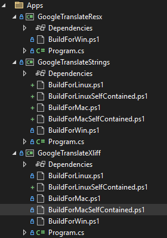
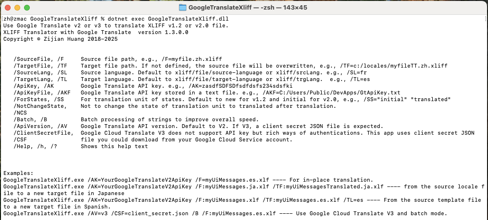

# Background
For full-stack software developers, there are wide variety of tools like:
* PO Editor
* ResX Resource Manager
* ResX Editor & Translator
* ...

The translation tools used by software developers:
1. Integration with IDE like Visual Studio, XCode and Android Studio etc.
2. Batch processing.

As of 2020s, most tools you could find are cloud based, depending to another cloud-based translation services like Google Translate API and Microsoft Translator API. And these tools are mostly subscription based. If you do translations only occasionally and casually, such subscription model is not appealing. Also the operation overheads of these cloud based tools are too much for smooth SDLC or CI.

Additionally, if you prefer batch processing, the CLI tools included in this project, developed by a full-stack software developer for full-stack software developers, may be appealing to you.

# Overview

**Supported Translation Resource Formats:**
* XLIFF 1.2
* XLIFF 2.0
* Microsoft ResX
* Android String Resource

**Supported Translation Engines:**
* Google Translate v2
* Google Cloud Translation v3

**Remarks:**
* It is presumed that you have rich experience in using each translation engine through API regarding setup and authentication.

# Tools
According to [Cloud Translation pricing](https://cloud.google.com/translate/pricing#charged-characters):

* You are charged for all characters that you include in a Cloud Translation request, even untranslated characters. This includes, for example, whitespace characters. If you translate `<p>こんにちは</p>` to English, it counts as 12 characters for the purposes of billing.
* Cloud Translation also charges for empty queries. If you make a request without any content, Cloud Translation charges one character for the request.

Since a XLIFF translation unit may contain elements of interpolation, simply sending the content to Google Translate with `translateHtml` may trigger unnecessary code points and charging, the core logic of these tools sends only the plain text content to save money.

For the detailed features, just run the CLI tool without parameters you will see help and examples.

## GoogleTranslateXliff.exe

```
GoogleTranslateXliff.exe
Use Google Translate v2 or v3 to translate XLIFF v1.2 or v2.0 file.
XLIFF Translator with Google Translate  version 1.3.0.0
Copyright c Zijian Huang 2018-2025


   /SourceFile, /F     Source file path, e.g., /F=myfile.zh.xliff
   /TargetFile, /TF    Target file path. If not defined, the source file will be overwritten, e.g.,
                       /TF=c:/locales/myfileTT.zh.xliff
   /SourceLang, /SL    Source language. Default to xliff/file/source-language or xliff/srcLang. e.g., /SL=fr
   /TargetLang, /TL    Target language. Default to xliff/file/target-language or xliff/trgLang.  e.g., /TL=es
   /ApiKey, /AK        Google Translate API key. e.g., /AK=zasdfSDFSDfsdfdsfs234sdsfki
   /ApiKeyFile, /AKF   Google Translate API key stored in a text file. e.g.,
                       /AKF=C:/Users/Public/DevApps/GtApiKey.txt
   /ForStates, /SS     For translation unit of states. Default to new for v1.2 and initial for v2.0, e.g.,
                       /SS="initial" "translated"
   /NotChangeState,    Not to change the state of translation unit to translated after translation.
   /NCS
   /Batch, /B          Batch processing of strings to improve overall speed.
   /ApiVersion, /AV    Google Translate API version. Default to V2. If V3, a client secret JSON file is expected.
   /ClientSecretFile,  Google Cloud Translate V3 does not support API key but rich ways of authentications. This app
   /CSF                uses client secret JSON file you could download from your Google Cloud Service account.
   /Help, /h, /?       Shows this help text


Examples:
GoogleTranslateXliff.exe /AK=YourGoogleTranslateV2ApiKey /F=myUiMessages.es.xlf ---- For in-place translation.
GoogleTranslateXliff.exe /AK=YourGoogleTranslateV2ApiKey /F:myUiMessages.ja.xlf /TF:myUiMessagesTranslated.ja.xlf ---- from the source locale file to a new target file in Japanese
GoogleTranslateXliff.exe /AK=YourGoogleTranslateV2ApiKey /F:myUiMessages.xlf /TF:myUiMessages.es.xlf /TL=es ---- From the source template file to a new target file in Spanish.
GoogleTranslateXliff.exe /AV=v3 /CSF=client_secret.json /B /F:myUiMessages.es.xlf ---- Use Google Cloud Translate V3 and batch mode.
```

**Hints:**
* By default among all [states](https://docs.oasis-open.org/xliff/v1.2/os/xliff-core.html#state) of XLIFF 1.2, this program cares about only "new" and "translated".
* By default among all [states](https://docs.oasis-open.org/xliff/xliff-core/v2.0/xliff-core-v2.0.html#state) of XLIFF 2.0, this program cares about only "initial" and "translated".
* If you have human translators involved in the SDLC, the translators may change the states to "reviewed" or "final" etc.


## GoogleTranslateResx.exe

```
GoogleTranslateResx.exe
Use Google Translate v2 or v3 to translate Microsoft ResX
ResX Translator with Google Translate  version 1.2.0.0
Copyright c Zijian Huang 2018-2025


   /SourceFile, /F     Source file path, e.g., /F=AppResources.resx
   /TargetFile, /TF    Target file path. e.g., /TF=c:/AppResources.ja.resx
   /SourceLang, /SL    Source language. e.g., /SL=fr
   /TargetLang, /TL    Target language. e.g., /TL=zh
   /ApiKey, /AK        Google Translate API key. e.g., /AK=zasdfSDFSDfsdfdsfs234sdsfki
   /ApiKeyFile, /AKF   Google Translate API key stored in a text file. e.g.,
                       /AKF=C:/Users/Public/DevApps/GtApiKey.txt
   /Batch, /B          Batch processing of strings to improve overall speed. V2 and V3 support.
   /ApiVersion, /AV    Google Translate API version. Default to V2. If V3, a client secret JSON file is expected.
   /ClientSecretFile,  Google Cloud Translate V3 does not support API key but rich ways of authentications. This app
   /CSF                uses client secret JSON file you could download from your Google Cloud Service account.
   /Help, /h, /?       Shows this help text


Examples:
GoogleTranslateResx.exe /AK=YourGoogleTranslateV2ApiKey /SL=en /TL=zh-hant /F:AppResources.zh-hant.resx ---- For in-place translation when AppResources.zh-hant.resx is not yet translated
GoogleTranslateResx.exe /AK=YourGoogleTranslateV2ApiKey /SL=en /TL=ja /F:strings.xml /TF:AppResources.ja.resx ---- from the source locale file to a new target file in Japanese
GoogleTranslateResx.exe /AK=YourGoogleTranslateV2ApiKey /F:AppResources.resx /TF:AppResources.es.resx /TL=es ---- From the source template file to a new target file in Spanish.
GoogleTranslateResx.exe /AV=v3 /CSF=client_secret.json /B  /SL=en /TL=es /F:AppResources.es.resx ---- Use Google Cloud Translate V3 and batch mode.
```

## GoogleTranslateStrings.exe

```
GoogleTranslateStrings.exe
Use Google Translate v2 or v3 to translate String Resource
Google Translate for Android String Resource  version 1.0
Fonlow (c) 2025


   /SourceFile, /F     Source file path, e.g., /F=strings.xml
   /TargetFile, /TF    Target file path. e.g., /TF=c:/strings.zh.xml
   /SourceLang, /SL    Source language. e.g., /SL=fr
   /TargetLang, /TL    Target language. e.g., /TL=zh
   /ApiKey, /AK        Google Translate API key. e.g., /AK=zasdfSDFSDfsdfdsfs234sdsfki
   /Batch, /B          Batch processing of strings to improve overall speed. V2 and V3 support.
   /ApiVersion, /AV    Google Translate API version. Default to V2. If V3, a client secret JSON file is expected.
   /ClientSecretFile,  Google Cloud Translate V3 does not support API key but rich ways of authentications. This app uses client
   /CSF                secret JSON file you could download from your Google Cloud Service account.
   /Help, /h, /?       Shows this help text


Examples:
GoogleTranslateStrings.exe /AK=YourGoogleTranslateV2ApiKey /SL=en /TL=zh-hant /F:strings.zh-hant.xml ---- For in-place translation when strings.zh-hant.xml is not yet translated
GoogleTranslateStrings.exe /AK=YourGoogleTranslateV2ApiKey /SL=en /TL=ja /F:strings.xml /TF:strings.ja.xml ---- from the source locale file to a new target file in Japanese
GoogleTranslateStrings.exe /AK=YourGoogleTranslateV2ApiKey /F:myUiMessages.xml /TF:myUiMessages.es.xml /TL=es ---- From the source template file to a new target file in Spanish.
GoogleTranslateStrings.exe /AV=v3 /CSF=client_secret.json /B  /SL=en /TL=es /F:myUiMessages.es.xml ---- Use Google Cloud Translate V3 and batch mode.
```

## XliffResXConverter.exe

This program can merge what in ResX to XLIFF, and merge XLIFF back to ResX. Together with GoogleTranslateXliff.exe and some PowerShell scripts, you may establish seamless SDLC and Continuous Integration. Check [README](XliffResXConverter/README.md) for details.

# Build and Deployment

**Prerequisites:**
* .NET 9 SDK for development and build
* .NET 9 Runtime for execution

This repository does not release binary builds generally. You may check-out the source codes of master or a latest tag like v1_stable, and then use respective PS1 scripts to build each CLI app for Windows, [MacOS](https://learn.microsoft.com/en-us/dotnet/core/install/macos) or [Linux](https://learn.microsoft.com/en-us/dotnet/core/install/linux).





# Continuous Integration

The [PowerShell folder](Docs/PowerShell) of this repository provides a few examples of PowerShell scripts for CI:
* [GoogleTranslate.ps1](Docs/PowerShell/Angular/GoogleTranslate.ps1) for Angular 2+.
* [MergeTranslateMerge.ps1](Docs/PowerShell/Fonlow.VA.Languages/MergeTranslateMerge.ps1) for [Visual Studio ResX using XLIFF as Translation Memory](XliffResXConverter/README.md).

# Articles

* [Batch Processing of Translation Resource for Angular Apps](/Docs//Articles/BatchProcessingAngular.md) also published on [dev.to](https://dev.to/zijianhuang/batch-processing-of-translation-resource-for-angular-apps-1il9) .