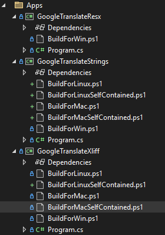
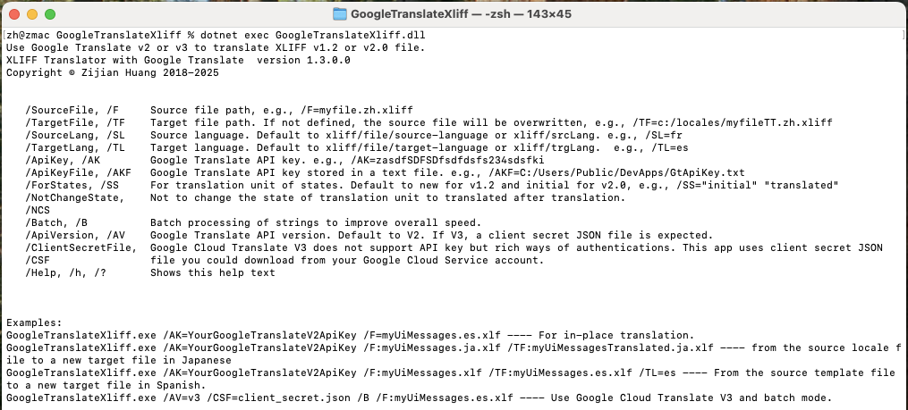

- [Overview](#overview)
- [Core Value Proposition](#core-value-proposition)
  - [Background](#background)
- [Tools](#tools)
  - [GoogleTranslateXliff.exe](#googletranslatexliffexe)
  - [GoogleTranslateResx.exe](#googletranslateresxexe)
  - [GoogleTranslateStrings.exe](#googletranslatestringsexe)
  - [GoogleTranslateXml.exe](#googletranslatexmlexe)
  - [GoogleTranslateJson.exe](#googletranslatejsonexe)
  - [GoogleTranslateHtml.exe](#googletranslatehtmlexe)
  - [MsTranslatorXliff.exe](#mstranslatorxliffexe)
  - [MsTranslatorResx.exe](#mstranslatorresxexe)
  - [MsTranslatorStrings.exe](#mstranslatorstringsexe)
  - [MsTranslatorXml.exe](#mstranslatorxmlexe)
  - [MsTranslatorJson.exe](#mstranslatorjsonexe)
  - [MsTranslatorHtml.exe](#mstranslatorhtmlexe)
  - [XliffResXConverter.exe](#xliffresxconverterexe)
- [Build and Deployment](#build-and-deployment)
  - [Microsoft Translator](#microsoft-translator)
  - [Google Translate](#google-translate)
- [Continuous Integration](#continuous-integration)
- [Articles](#articles)
- [Contributing](#contributing)
- [Artificial Intelligence](#artificial-intelligence)
- [Examples](#examples)


Batch translation of app translation resource files through CLI tools with machine translation engines.

# Overview

AppTranslation is a collection of developer-focused CLI tools and libraries designed to automate batch translation of application resources (UI text, localization files, and data artifacts) using Google Translate APIs and Microsoft Translators. 

It’s essentially a local-first alternative to SaaS localization platforms, built for developers who want:

* Automation inside builds or scripts (CI/CD)
* No subscription tools
* Fast batch processing of files

**Hints:**
* This repos has started for app translation resource files like XLIFF and RESX etc, and now it also supports arbitrary meta file like JSON, XML and HTML.

AppTranslation includes a [framework through a set of interfaces and shared libraries](CONTRIBUTING.md) for extending supports for other meta formats and translation engines.

# Core Value Proposition

*“Translate your app’s localization files in bulk, cheaply, and scriptably.”*

Key differentiators:

* Fully **CLI-driven (automation-ready)**
* Works with **industry-standard formats** (XLIFF, ResX, Android XML)
* Avoids unnecessary API costs by sending only text (not markup)
* Extensible architectural design for adapting new file formats and new translation engines

**Supported Translation Resource Formats:**
* XLIFF 1.2
* XLIFF 2.0
* Microsoft ResX
* Android String Resource

**Supported Generic Formats:**
* JSON, text leafs of nodes selected by JsonPaths. For example, `.xcstrings` of XCode 15+
* XML,  text leafs of nodes selected by XPaths. For example, SVG text, and HTML text nodes of `application/xhtml+xml`
* HTML, document or nodes selected by XPaths

**Supported Translation Engines:**
* Google Translate v2 (Cloud Translation - Basic API)
* [Google Cloud Translation v3 (Advanced API)](https://docs.cloud.google.com/translate/docs/overview)
* Microsoft Azure AI Translator

You should setup your own accounts and API credentials of these engines.

**Supported Conversion:**
* Convert and merge between ResX and XLIFF 1.2 / 2.0

Through proper scripting, .NET translation resource could be using XLIFF as Translation Memory.

**Prerequisites:**
* You have rich experience in using each translation engine through API regarding setup and authentication. Or you study the documentations of respective engines.

**Supported Operating Systems:**

* Windows
* MacOS
* Linux

## Background
For full-stack software developers, there are wide variety of tools like:
* PO Editor
* ResX Resource Manager
* ResX Editor & Translator
* ...

The translation tools used by software developers:
1. Integration with IDE like Visual Studio, XCode and Android Studio etc.
2. Batch processing.

As of 2020s, most tools you could find are cloud based, depending to another cloud-based translation services like Google Translate API and Microsoft Translator API. And these tools are mostly subscription based. If you do translations only occasionally and casually, such subscription model may not be appealing. Also the operation overheads of these cloud based tools are too much for smooth SDLC or CI.

Additionally, if you prefer batch processing, the CLI tools included in this project, developed by a full-stack software developer for full-stack software developers, may be appealing to you.

# Tools
According to [Google Cloud Translation pricing](https://cloud.google.com/translate/pricing#charged-characters):

* You are charged for all characters that you include in a Cloud Translation request, even untranslated characters. This includes, for example, whitespace characters. If you translate `<p>こんにちは</p>` to English, it counts as 12 characters for the purposes of billing.
* Cloud Translation also charges for empty queries. If you make a request without any content, Cloud Translation charges one character for the request.

XLIFF translation units may contain elements of interpolation like:
 ```xml
 <source>File size is <ph id="0" equiv="PH" disp="ByteFormatPipe.formatBytes(this.file.size)"/>, and it may take sometime to upload.</source>
 ```
 Simply sending the content to Google Translate with `translate` or `translateHtml` may trigger unnecessary code points and charging, the core logic of these tools sends only the plain text content to save money.

For the detailed features, just run the CLI tool without parameters you will see help and examples.

## GoogleTranslateXliff.exe

```
GoogleTranslateXliff.exe
Use Google Translate v2 or v3 to translate XLIFF v1.2 or v2.0 file.
XLIFF Translator with Google Translate  version 1.4.0.0
Copyright © Zijian Huang 2018-2025


   /ForStates, /SS     For translation unit of states. Default to new for v1.2 and initial for v2.0, e.g.,
                       /SS="initial" "translated"
   /NotChangeState,    Not to change the state of translation unit to translated after translation.
   /NCS
   /ApiKey, /AK        Google Translate API key. e.g., /AK=zasdfSDFSDfsdfdsfs234sdsfki
   /ApiKeyFile, /AKF   Google Translate API key stored in a text file. e.g.,
                       /AKF=C:/Users/Public/DevApps/GtApiKey.txt
   /ApiVersion, /AV    Google Translate API version. Default to V2. If V3, a client secret JSON file is expected.
   /ClientSecretFile,  Google Cloud Translate V3 does not support API key but rich ways of authentications. This app
   /CSF                uses client secret JSON file you could download from your Google Cloud Service account.
   /SourceFile, /F     Source file path
   /TargetFile, /TF    Target file path
   /SourceLang, /SL    Source language. e.g., /SL=fr
   /TargetLang, /TL    Target language. e.g., /TL=zh
   /Batch, /B          Batch processing of string array to improve overall speed.
   /Help, /h, /?       Shows this help text


Examples:
GoogleTranslateXliff.exe /AK=YourGoogleTranslateV2ApiKey /F=myUiMessages.es.xlf ---- For in-place translation.
GoogleTranslateXliff.exe /AK=YourGoogleTranslateV2ApiKey /F:myUiMessages.ja.xlf /TF:myUiMessagesTranslated.ja.xlf ---- from the source locale file to a new target file in Japanese
GoogleTranslateXliff.exe /AK=YourGoogleTranslateV2ApiKey /F:myUiMessages.xlf /TF:myUiMessages.es.xlf /TL=es ---- From the source template file to a new target file in Spanish.
GoogleTranslateXliff.exe /AV=v3 /CSF=client_secret.json /B /F:myUiMessages.es.xlf ---- Use Google Cloud Translate V3 and batch mode.
```

**Hints:**
* By default among all [states](https://docs.oasis-open.org/xliff/v1.2/os/xliff-core.html#state) of XLIFF 1.2, this program cares about only "new" and "translated".
* By default among all [states](https://docs.oasis-open.org/xliff/xliff-core/v2.0/xliff-core-v2.0.html#state) of XLIFF 2.0, this program cares about only "initial" and "translated".
* If you have human translators involved in the SDLC, the translators may change the states to "reviewed" or "final" etc.


## GoogleTranslateResx.exe

```
GoogleTranslateResx.exe
Use Google Translate v2 or v3 to translate Microsoft ResX
ResX Translator with Google Translate  version 1.2.0.0
Copyright © Zijian Huang 2018-2025


   /SourceFile, /F     Source file path, e.g., /F=AppResources.resx
   /TargetFile, /TF    Target file path. e.g., /TF=c:/AppResources.ja.resx
   /SourceLang, /SL    Source language. e.g., /SL=fr
   /TargetLang, /TL    Target language. e.g., /TL=zh
   /ApiKey, /AK        Google Translate API key. e.g., /AK=zasdfSDFSDfsdfdsfs234sdsfki
   /ApiKeyFile, /AKF   Google Translate API key stored in a text file. e.g.,
                       /AKF=C:/Users/Public/DevApps/GtApiKey.txt
   /Batch, /B          Batch processing of strings to improve overall speed. V2 and V3 support.
   /ApiVersion, /AV    Google Translate API version. Default to V2. If V3, a client secret JSON file is expected.
   /ClientSecretFile,  Google Cloud Translate V3 does not support API key but rich ways of authentications. This app
   /CSF                uses client secret JSON file you could download from your Google Cloud Service account.
   /Help, /h, /?       Shows this help text


Examples:
GoogleTranslateResx.exe /AK=YourGoogleTranslateV2ApiKey /SL=en /TL=zh-hant /F:AppResources.zh-hant.resx ---- For in-place translation when AppResources.zh-hant.resx is not yet translated
GoogleTranslateResx.exe /AK=YourGoogleTranslateV2ApiKey /SL=en /TL=ja /F:strings.xml /TF:AppResources.ja.resx ---- from the source locale file to a new target file in Japanese
GoogleTranslateResx.exe /AK=YourGoogleTranslateV2ApiKey /F:AppResources.resx /TF:AppResources.es.resx /TL=es ---- From the source template file to a new target file in Spanish.
GoogleTranslateResx.exe /AV=v3 /CSF=client_secret.json /B  /SL=en /TL=es /F:AppResources.es.resx ---- Use Google Cloud Translate V3 and batch mode.
```

## GoogleTranslateStrings.exe

```
GoogleTranslateStrings.exe
Use Google Translate v2 or v3 to translate String Resource
Google Translate for Android String Resource  version 1.0
Fonlow (c) 2025


   /SourceFile, /F     Source file path, e.g., /F=strings.xml
   /TargetFile, /TF    Target file path. e.g., /TF=c:/strings.zh.xml
   /SourceLang, /SL    Source language. e.g., /SL=fr
   /TargetLang, /TL    Target language. e.g., /TL=zh
   /ApiKey, /AK        Google Translate API key. e.g., /AK=zasdfSDFSDfsdfdsfs234sdsfki
   /Batch, /B          Batch processing of strings to improve overall speed. V2 and V3 support.
   /ApiVersion, /AV    Google Translate API version. Default to V2. If V3, a client secret JSON file is expected.
   /ClientSecretFile,  Google Cloud Translate V3 does not support API key but rich ways of authentications. This app uses client
   /CSF                secret JSON file you could download from your Google Cloud Service account.
   /Help, /h, /?       Shows this help text


Examples:
GoogleTranslateStrings.exe /AK=YourGoogleTranslateV2ApiKey /SL=en /TL=zh-hant /F:strings.zh-hant.xml ---- For in-place translation when strings.zh-hant.xml is not yet translated
GoogleTranslateStrings.exe /AK=YourGoogleTranslateV2ApiKey /SL=en /TL=ja /F:strings.xml /TF:strings.ja.xml ---- from the source locale file to a new target file in Japanese
GoogleTranslateStrings.exe /AK=YourGoogleTranslateV2ApiKey /F:myUiMessages.xml /TF:myUiMessages.es.xml /TL=es ---- From the source template file to a new target file in Spanish.
GoogleTranslateStrings.exe /AV=v3 /CSF=client_secret.json /B  /SL=en /TL=es /F:myUiMessages.es.xml ---- Use Google Cloud Translate V3 and batch mode.
```

## GoogleTranslateXml.exe
```
GoogleTranslateXml.exe
Use Google Translate v2 or v3 to translate XML Text based on XPaths
JSON Translator using Google Translate v2 or v3  version 1.1.0.0
Copyright © Zijian Huang 2011-2026


   /XPaths, /XPS       XML text nodes to be translated represented by Xpaths, e.g., /XPS=`//svg:text/svg:tspan`
                       `//ns:pp/ns:span` in Windows CMD, and add --% after the command in PowerShell 5.1, and for
                       running in PowerShell 7 or using complex XPath queries, utilize XPathsFile
   /XPathsFile, /XPSF  Each line declares a XPath for text nodes to be translated, e.g., /XPSF=XPaths.txt
   /ApiKey, /AK        Google Translate API key. e.g., /AK=zasdfSDFSDfsdfdsfs234sdsfki
   /ApiKeyFile, /AKF   Google Translate API key stored in a text file. e.g.,
                       /AKF=C:/Users/Public/DevApps/GtApiKey.txt
   /ApiVersion, /AV    Google Translate API version. Default to V2. If V3, a client secret JSON file is expected.
   /ClientSecretFile,  Google Cloud Translate V3 does not support API key but rich ways of authentications. This app
   /CSF                uses client secret JSON file you could download from your Google Cloud Service account.
                       Translate from target language to source language and save the result to the target file so
   /ReversedTranslation, you can compare. Both SourceFile and TargetFile must be defined.                               
   /Reversed
   /SourceFile, /F     Source file path
   /TargetFile, /TF    Target file path. Without this, the source file is also the target file.
   /SourceLang, /SL    Source language. e.g., /SL=fr
   /TargetLang, /TL    Target language. e.g., /TL=zh
   /Batch, /B          Batch processing of string array to improve overall speed.
   /Help, /h, /?       Shows this help text


Examples:
GoogleTranslateXml.exe /AKF=apikey.txt /SL=en /TL="zh-hant" /XPaths=`//svg:text/svg:tspan` /F=../Tests/template1.svg /TF=../Tests/template1.zh-Hant.svg
GoogleTranslateXml.exe /CSF=GTV3KeyFile.txt /AV=V3 /SL=en /TL=""zh-hant"" /XPaths=`//svg:text/svg:tspan` /B /F=../Tests/template1.svg /TF=../Tests/template1.zh-Hant.svg
```

**Hints:**
* For complex XPath queries with characters in conflicting against the syntax of CLI parameters, it may be more convenient to declare through the `XPathsFile` option like [xpaths.txt](https://github.com/zijianhuang/apptranslation/blob/master/GoogleTranslateXml/xpaths.txt).
* To translate text nodes of SVG, here's an [example PowerShell script](https://github.com/zijianhuang/apptranslation/blob/master/GoogleTranslateXml/translateSvg.ps1). Therefore, this app can replace [GoogleTranslateSvgText.exe](https://github.com/zijianhuang/apptranslation/tree/master/GoogleTranslateSvgText) which is deprecated.

## GoogleTranslateJson.exe
```
GoogleTranslateJson.exe
Use Google Translate v2 or v3 to translate selected string value properties of JSON object
JSON translation using Google Translate  version 1.2.0.0
Copyright © Zijian Huang 2011-2026


   /Properties, /PS    JSON object properties to be translated represented by JSONPath, e.g., /PS="parent.folder.name" "parent.folder.address"
   /PropertiesFile,    Each line declares a JSON object property to be translated represented by JSONPath is accepted, e.g.,
   /PSF                /PSF=JsonProperties.txt
   /ApiKey, /AK        Google Translate API key. e.g., /AK=zasdfSDFSDfsdfdsfs234sdsfki
   /ApiKeyFile, /AKF   Google Translate API key stored in a text file. e.g., /AKF=C:/Users/Public/DevApps/GtApiKey.txt
   /ApiVersion, /AV    Google Translate API version. Default to V2. If V3, a client secret JSON file is expected.
   /ClientSecretFile,  Google Cloud Translate V3 does not support API key but rich ways of authentications. This app uses client secret JSON
   /CSF                file you could download from your Google Cloud Service account.
                       Translate from target language to source language and save the result to the target file so you can compare. Both
   /ReversedTranslation, SourceFile and TargetFile must be defined.                                                                                
   /Reversed
   /SourceFile, /F     Source file path
   /TargetFile, /TF    Target file path. Without this, the source file is also the target file.
   /SourceLang, /SL    Source language. e.g., /SL=fr
   /TargetLang, /TL    Target language. e.g., /TL=zh
   /Batch, /B          Batch processing of string array to improve overall speed.
   /Help, /h, /?       Shows this help text


Examples:
GoogleTranslateJson.exe /AK=YourGoogleTranslateV2ApiKey /SL=en /TL=zh-hant /F:jsonld.zh-hant.json /PS:data.user.name data.user.address ---- For in-place translation when jsonld.zh-hant.json is not yet translated
GoogleTranslateJson.exe /AK=YourGoogleTranslateV2ApiKey /SL=en /TL=ja /F:jsonld.json /TF:jsonld.ja.json /PS:data.user.name ---- from the source locale file to a new target file in Japanese
GoogleTranslateJson.exe /AK=YourGoogleTranslateV2ApiKey /F:jsonld.json /TF:jsonld.es.json /TL=es /PS:data.user.name ---- From the source template file to a new target file in Spanish.
GoogleTranslateJson.exe /AV=v3 /CSF=client_secret.json /B /Ind /NUE /SC=2 /SL=en /TL=es /F:jsonld.es.json /PS:data.user.name ---- Use Google Cloud Translate V3 and batch mode.
```

## GoogleTranslateHtml.exe
```
Use Google Translate v2 or v3 to translate HTML document or nodes based on XPaths
HTML Translator using Google Translate v2 or v3  version 1.0.0.0
Copyright © Zijian Huang 2011-2026


   /XPaths, /XPS       HTML nodes to be translated represented by Xpaths, e.g., /XPS=`//h2` `ul` in Windows CMD, and
                       add --% after the command in PowerShell 5.1, and for running in PowerShell 7 or using complex
                       XPath queries, utilize XPathsFile
   /XPathsFile, /XPSF  Each line declares a XPath for HTML nodes to be translated, e.g., /XPSF=XPaths.txt
   /ApiKey, /AK        Google Translate API key. e.g., /AK=zasdfSDFSDfsdfdsfs234sdsfki
   /ApiKeyFile, /AKF   Google Translate API key stored in a text file. e.g.,
                       /AKF=C:/Users/Public/DevApps/GtApiKey.txt
   /ApiVersion, /AV    Google Translate API version. Default to V2. If V3, a client secret JSON file is expected.
   /ClientSecretFile,  Google Cloud Translate V3 does not support API key but rich ways of authentications. This app
   /CSF                uses client secret JSON file you could download from your Google Cloud Service account.
                       Translate from target language to source language and save the result to the target file so
   /ReversedTranslation, you can compare. Both SourceFile and TargetFile must be defined.
   /Reversed
   /SourceFile, /F     Source file path
   /TargetFile, /TF    Target file path. Without this, the source file is also the target file.
   /SourceLang, /SL    Source language. e.g., /SL=fr. Default en. If SL==TL, source file is simply copied to target
                       file.
   /TargetLang, /TL    Target language. e.g., /TL=zh.
   /Batch, /B          Batch processing of string array to improve overall speed.
   /Help, /h, /?       Shows this help text


Examples:
GoogleTranslateHtml.exe /AKF=apikey.txt /SL=en /TL="zh-hant" /F=../Tests/template1.html /TF=../Tests/template1.zh-Hant.html -- HTML document
GoogleTranslateHtml.exe /CSF=$GTV3KeyFile /AV=V3 /SL=en /TL="de" /XPaths=`//body/h1` /B /F=../Tests/template1.html /TF=../Tests/template1.de.html -- HTML nodes
```

## MsTranslatorXliff.exe

```
MsTranslatorXliff.exe
Use Microsoft Azure AI Translator to translate XLIFF v1.2 or v2.0 file.
MsTranslatorXliff  version 1.0.0.0


   /ForStates, /SS     For translation unit of states. Default to new for v1.2 and initial for v2.0, e.g.,
                       /SS="initial" "translated"
   /NotChangeState,    Not to change the state of translation unit to translated after translation.
   /NCS
   /ApiKey, /AK        Microsoft Translator API key. e.g., /AK=zasdfSDFSDfsdfdsfs234sdsfki
   /ApiKeyFile, /AKF   MS Translator API key stored in a text file. e.g., /AKF=C:/Users/Public/DevApps/GtApiKey.txt
   /Region, /RG        Region associated with the key. Always required. e.g., /RG=australiaeast
   /CategoryId, /CA    Category ID from one of your custom translator's projects in the form of
                       WorkspaceID+CategoryCode, used by Batch mode, while the default is general . e.g.,
                       /CA=a3a1eeb1-7e2b-4098-b293-da762fe3bb79-INTERNT
   /SourceFile, /F     Source file path
   /TargetFile, /TF    Target file path
   /SourceLang, /SL    Source language. e.g., /SL=fr
   /TargetLang, /TL    Target language. e.g., /TL=zh
   /Batch, /B          Batch processing of string array to improve overall speed.
   /Help, /h, /?       Shows this help text


Examples:
MsTranslatorXliff.exe /AK=MsTranslatorApiKey /RG=australiaeast /F=myUiMessages.es.xlf ---- For in-place translation.
MsTranslatorXliff.exe /AK=MsTranslatorApiKey /RG=australiaeast /F:myUiMessages.ja.xlf /TF:myUiMessagesTranslated.ja.xlf ---- from the source locale file to a new target file in Japanese
MsTranslatorXliff.exe /AK=MsTranslatorApiKey /RG=australiaeast /F:myUiMessages.xlf /TF:myUiMessages.es.xlf /TL=es ---- From the source template file to a new target file in Spanish.
```

## MsTranslatorResx.exe

```
MsTranslatorResx.exe
Use Microsoft Azure AI Translator to translate Microsoft ResX
MsTranslatorResx  version 1.0.0.0


   /ApiKey, /AK        Microsoft Translator API key. e.g., /AK=zasdfSDFSDfsdfdsfs234sdsfki
   /ApiKeyFile, /AKF   MS Translator API key stored in a text file. e.g., /AKF=C:/Users/Public/DevApps/GtApiKey.txt
   /Region, /RG        Region associated with the key. Always required. e.g., /RG=australiaeast
   /CategoryId, /CA    Category ID from one of your custom translator's projects in the form of
                       WorkspaceID+CategoryCode, used by Batch mode, while the default is general . e.g.,
                       /CA=a3a1eeb1-7e2b-4098-b293-da762fe3bb79-INTERNT
   /SourceFile, /F     Source file path
   /TargetFile, /TF    Target file path
   /SourceLang, /SL    Source language. e.g., /SL=fr
   /TargetLang, /TL    Target language. e.g., /TL=zh
   /Batch, /B          Batch processing of string array to improve overall speed.
   /Help, /h, /?       Shows this help text


Examples:
MsTranslatorResx.exe /AK=MsTranslatorApiKey /RG=australiaeast /SL=en /TL=zh-hant /F:AppResources.zh-hant.resx ---- For in-place translation when AppResources.zh-hant.resx is not yet translated
MsTranslatorResx.exe /AK=MsTranslatorApiKey /RG=australiaeast /SL=en /TL=ja /F:strings.xml /TF:AppResources.ja.resx ---- from the source locale file to a new target file in Japanese
MsTranslatorResx.exe /AK=MsTranslatorApiKey /RG=australiaeast /F:AppResources.resx /TF:AppResources.es.resx /TL=es ---- From the source template file to a new target file in Spanish.
```

## MsTranslatorStrings.exe

```
MsTranslatorStrings.exe
Use Microsoft Azure AI Translator to translate Android String Resource
MsTranslatorStrings  version 1.0.0.0


   /ApiKey, /AK        Microsoft Translator API key. e.g., /AK=zasdfSDFSDfsdfdsfs234sdsfki
   /ApiKeyFile, /AKF   MS Translator API key stored in a text file. e.g., /AKF=C:/Users/Public/DevApps/GtApiKey.txt
   /Region, /RG        Region associated with the key. Always required. e.g., /RG=australiaeast
   /CategoryId, /CA    Category ID from one of your custom translator's projects in the form of
                       WorkspaceID+CategoryCode, used by Batch mode, while the default is general . e.g.,
                       /CA=a3a1eeb1-7e2b-4098-b293-da762fe3bb79-INTERNT
   /SourceFile, /F     Source file path
   /TargetFile, /TF    Target file path
   /SourceLang, /SL    Source language. e.g., /SL=fr
   /TargetLang, /TL    Target language. e.g., /TL=zh
   /Batch, /B          Batch processing of string array to improve overall speed.
   /Help, /h, /?       Shows this help text


Examples:
MsTranslatorStrings.exe /AK=MsTranslatorApiKey /RG=australiaeast /SL=en /TL=zh-hant /F:AppResources.zh-hant.xml ---- For in-place translation when AppResources.zh-hant.xml is not yet translated
MsTranslatorStrings.exe /AK=MsTranslatorApiKey /RG=australiaeast /SL=en /TL=ja /F:strings.xml /TF:AppResources.ja.xml ---- from the source locale file to a new target file in Japanese
MsTranslatorStrings.exe /AK=MsTranslatorApiKey /RG=australiaeast /F:AppResources.xml /TF:AppResources.es.xml /TL=es ---- From the source template file to a new target file in Spanish.
```

## MsTranslatorXml.exe
```
MsTranslatorXml.exe
Use MS Translator to translate XML Text based on XPaths
JSON Translator using Microsoft Translator  version 1.0.0.0
Copyright © Zijian Huang 2011-2026


   /XPaths, /XPS       XML text nodes to be translated represented by Xpaths, e.g., /XPS=`//svg:text/svg:tspan`
                       `//ns:pp/ns:span` in Windows CMD, and add --% after the command in PowerShell 5.1, and for
                       running in PowerShell 7 or using complex XPath queries, utilize XPathsFile
   /XPathsFile, /XPSF  Each line declares a XPath for text nodes to be translated, e.g., /XPSF=XPaths.txt
   /ApiKey, /AK        Microsoft Translator API key. e.g., /AK=zasdfSDFSDfsdfdsfs234sdsfki
   /ApiKeyFile, /AKF   MS Translator API key stored in a text file. e.g., /AKF=C:/Users/Public/DevApps/GtApiKey.txt
   /Region, /RG        Region associated with the key. Always required. e.g., /RG=australiaeast
   /CategoryId, /CA    Category ID from one of your custom translator's projects in the form of
                       WorkspaceID+CategoryCode, used by Batch mode, while the default is general . e.g.,
                       /CA=a3a1eeb1-7e2b-4098-b293-da762fe3bb79-INTERNT
   /SourceFile, /F     Source file path
   /TargetFile, /TF    Target file path. Without this, the source file is also the target file.
   /SourceLang, /SL    Source language. e.g., /SL=fr
   /TargetLang, /TL    Target language. e.g., /TL=zh
   /Batch, /B          Batch processing of string array to improve overall speed.
   /Help, /h, /?       Shows this help text


Examples:
MsTranslatorXml.exe /AK=abcdefg /RG=uswest /SL=en /TL="zh-hant" /XPaths=`//svg:text/svg:tspan` /B /F=../Tests/template1.svg /TF=../Tests/template1.zh-Hant.svg
```

## MsTranslatorJson.exe

```
Use Microsoft Azure AI Translator to translate JSON object
JSON Translator using Microsoft Translator  version 1.5.0.0
Copyright © Zijian Huang 2011-2026


   /Properties, /PS    JSON object properties to be translated, e.g., /PS="parent.folder.name" "parent.folder.address"
   /PropertiesFile,    Each line declares a JSON object property to be translated, e.g., /PSF=JsonProperties.txt
   /PSF
   /ApiKey, /AK        Microsoft Translator API key. e.g., /AK=zasdfSDFSDfsdfdsfs234sdsfki
   /ApiKeyFile, /AKF   MS Translator API key stored in a text file. e.g., /AKF=C:/Users/Public/DevApps/GtApiKey.txt
   /Region, /RG        Region associated with the key. Always required. e.g., /RG=australiaeast
   /CategoryId, /CA    Category ID from one of your custom translator's projects in the form of WorkspaceID+CategoryCode, used by Batch mode,
                       while the default is general . e.g., /CA=a3a1eeb1-7e2b-4098-b293-da762fe3bb79-INTERNT
   /SourceFile, /F     Source file path
   /TargetFile, /TF    Target file path. Without this, the source file is also the target file.
   /SourceLang, /SL    Source language. e.g., /SL=fr. Default en. If SL==TL, source file is simply copied to target file.
   /TargetLang, /TL    Target language. e.g., /TL=zh.
   /Batch, /B          Batch processing of string array to improve overall speed.
   /Help, /h, /?       Shows this help text


Examples:
MsTranslatorteJson.exe /AK=YourMsTranslatorteApiKey /RG=australiaeast /SL=en /TL=zh-hant /F:jsonld.zh-hant.json /PS:data.user.name data.user.address ---- For in-place translation when jsonld.zh-hant.json is not yet translated
MsTranslatorteJson.exe /AK=YourMsTranslatorteApiKey /RG=australiaeast /SL=en /TL=ja /F:jsonld.json /TF:jsonld.ja.json /PS:data.user.name ---- from the source locale file to a new target file in Japanese
MsTranslatorteJson.exe /AK=YourMsTranslatorteApiKey /RG=australiaeast /Ind /NUE /SC=2 /F:jsonld.json /TF:jsonld.es.json /TL=es /PS:data.user.name ---- From the source template file to a new target file in Spanish.
```

## MsTranslatorHtml.exe

```
Use MS Translator to translate HTML document or nodes based on XPaths
HTML Translator using Microsoft Translator  version 1.0.0.0
Copyright © Zijian Huang 2011-2026


   /XPaths, /XPS       HTML nodes to be translated represented by Xpaths, e.g., /XPS=`//body/h1` `//body/ul` in Windows CMD, and add --% after
                       the command in PowerShell 5.1, and for running in PowerShell 7 or using complex XPath queries, utilize XPathsFile
   /XPathsFile, /XPSF  Each line declares a XPath for HTML nodes to be translated, e.g., /XPSF=XPaths.txt
   /ApiKey, /AK        Microsoft Translator API key. e.g., /AK=zasdfSDFSDfsdfdsfs234sdsfki
   /ApiKeyFile, /AKF   MS Translator API key stored in a text file. e.g., /AKF=C:/Users/Public/DevApps/GtApiKey.txt
   /Region, /RG        Region associated with the key. Always required. e.g., /RG=australiaeast
   /CategoryId, /CA    Category ID from one of your custom translator's projects in the form of WorkspaceID+CategoryCode, used by Batch mode,
                       while the default is general . e.g., /CA=a3a1eeb1-7e2b-4098-b293-da762fe3bb79-INTERNT
   /SourceFile, /F     Source file path
   /TargetFile, /TF    Target file path. Without this, the source file is also the target file.
   /SourceLang, /SL    Source language. e.g., /SL=fr. Default en. If SL==TL, source file is simply copied to target file.
   /TargetLang, /TL    Target language. e.g., /TL=zh.
   /Batch, /B          Batch processing of string array to improve overall speed.
   /Help, /h, /?       Shows this help text


Examples:
MsTranslatorHtml.exe /AK=abcdefg /RG=uswest /SL=en /TL="zh-hant" /XPaths=`//body/h1` /B /F=../Tests/template1.svg /TF=../Tests/template1.zh-Hant.svg
```

## XliffResXConverter.exe

This program can merge what in ResX to XLIFF, and merge XLIFF back to ResX. Together with GoogleTranslateXliff.exe and some PowerShell scripts, you may establish seamless SDLC and Continuous Integration. Check [README](XliffResXConverter/README.md) for details.

# Build and Deployment

**Prerequisites:**
* .NET 10 SDK for development and build
* .NET 10 Runtime for execution

You may check-out the source codes of master or a latest tag like v1_stable, and then use respective PS1 scripts to build each CLI app for Windows, [MacOS](https://learn.microsoft.com/en-us/dotnet/core/install/macos) or [Linux](https://learn.microsoft.com/en-us/dotnet/core/install/linux).





## Microsoft Translator

The translator service on MS Azure keep evolving rapidly. As of August 2025, the translation API keys are managed through:
* https://portal.azure.com/#view/Microsoft_Azure_ProjectOxford/CognitiveServicesHub/~/TextTranslation
* `Azure / AI Foundry / Translator / YourTranslatorInstance / Resource Management / Keys and Endpoint`

## Google Translate

The credentials are managed at:
* https://console.cloud.google.com/apis/credentials
* https://console.cloud.google.com/auth/clients

The credential typically expires in 6 months if no activity. To recreate, here the steps:
1. Create project
2. Create App/Branding
3. Create OAuth Client for Desktop app
4. Download JSON.

And make sure "Cloud Translation API" is included in Enabled APIs and services.


# Continuous Integration

The [PowerShell folder](Docs/PowerShell) of this repository provides a few examples of PowerShell scripts for CI:
* [GoogleTranslate.ps1](Docs/PowerShell/Angular/GoogleTranslate.ps1) for Angular 2+.
* [MergeTranslateMerge.ps1](Docs/PowerShell/Fonlow.VA.Languages/MergeTranslateMerge.ps1) for [Visual Studio ResX using XLIFF as Translation Memory](XliffResXConverter/README.md).

# Articles

* [Batch Processing of Translation Resource for Angular Apps](/Docs//Articles/BatchProcessingAngular.md) also published on [dev.to](https://dev.to/zijianhuang/batch-processing-of-translation-resource-for-angular-apps-1il9) .

# Contributing

Please check [CONTRIBUTING.md](CONTRIBUTING.md).

# Artificial Intelligence 

The capability of AI in recent years is amazing. When you have a bunch of data in simple meta structure, AI like Copilot could understand the structure and do the repetitive tasks for you. For example, in Google Play Console, before submitting an update, the "What's New" section presents:
```xml
<en-US>
1. Most built-in help contents are refined.
2. When the visual acuity notation is LogMAR, MAR  or VAS, the scoring of the assessment is LogMAR Scoring.
</en-US>
<ar>
Enter or paste your release notes for ar here
</ar>
<de-DE>
Enter or paste your release notes for de-DE here
</de-DE>
<es-ES>
Enter or paste your release notes for es-ES here
</es-ES>
<fil>
Enter or paste your release notes for fil here
</fil>
<fr-FR>
Enter or paste your release notes for fr-FR here
</fr-FR>
<hi-IN>
Enter or paste your release notes for hi-IN here
</hi-IN>
<id>
Enter or paste your release notes for id here
</id>
...
```

I asked Copilot to translate, and it gives fairly accurate translations conforming to the meta format.

```xml
<en-US>
1. Most built-in help contents are refined.
2. When the visual acuity notation is LogMAR, MAR or VAS, the scoring of the assessment is LogMAR Scoring.
</en-US>
<ar>
1. تم تحسين معظم محتويات المساعدة المدمجة.
2. عند استخدام رموز حدة البصر LogMAR أو MAR أو VAS، يتم احتساب التقييم باستخدام نظام LogMAR.
</ar>
<de-DE>
1. Die meisten integrierten Hilfetexte wurden überarbeitet.
2. Bei den Sehschärfeangaben LogMAR, MAR oder VAS erfolgt die Bewertung nach dem LogMAR-System.
</de-DE>
<es-ES>
1. La mayoría de los contenidos de ayuda integrados han sido refinados.
2. Cuando la notación de agudeza visual es LogMAR, MAR o VAS, la evaluación se realiza con puntuación LogMAR.
</es-ES>
...
<vi>
1. Hầu hết nội dung trợ giúp tích hợp đã được cải tiến.
2. Khi ký hiệu thị lực là LogMAR, MAR hoặc VAS, việc đánh giá sử dụng thang điểm LogMAR.
</vi>
<zh-CN>
1. 大多数内置帮助内容已优化。
2. 当视力表示为 LogMAR、MAR 或 VAS 时，评估采用 LogMAR 评分。
</zh-CN>
<zh-HK>
1. 大部分內置說明內容已經優化。
2. 當視力標示為 LogMAR、MAR 或 VAS 時，評估將採用 LogMAR 評分方式。
</zh-HK>

```

And you may try to use Copilot or alike to see if AI could replace the tools introduced in this open source project, especially when you have unlimited "free" tokens to use.

Keep this in mind: when AI does the initial analysis, a lot tokens will be consumed before doing the translation. Also the performance of ad-hoc analysis of meta structure along with the translation will be inherently slower than dediciated tools with:
1. Built-in dedicated parser and writer.
2. Direct hooks on dedicated translation engines.

# Examples

* [Eye Charts app](https://visualacuity.info/)for [Android](https://play.google.com/store/apps/details?id=com.fonlow.VAC) and [iOS](https://apps.apple.com/au/app/eye-charts/id1442509969). Native smartphone app built on Xamarin/MAUI.
* [Ishihara Color Blind Test](https://visualacuity.info/color-blind-test). Static site PWA built on Angular.
* [PowerShell scripts for real world development](https://zijianhuang.github.io/articles/Use%20AppTranslation%20in%20PWA%20Localized/) and [Mirror site at dev.to](https://dev.to/zijianhuang/speedup-localization-work-when-delivering-an-angular-pwa-2f0l).